# Procesverslag
**Auteur:** Roel Komen

Markdown cheat cheet: [Hulp bij het schrijven van Markdown](https://github.com/adam-p/markdown-here/wiki/Markdown-Cheatsheet). Nb. de standaardstructuur en de spartaanse opmaak zijn helemaal prima. Het gaat om de inhoud van je procesverslag. Besteedt de tijd voor pracht en praal aan je website.

## Bronnenlijst
1. https://stackoverflow.com/questions/25797627/why-is-font-awesome-not-working-on-my-jekyll-built-github-site voor het probleem waarom de icons niet afgebeeld werden in github pages
2. https://fontawesome.com/v4.7.0/icons/ voor de icons
3. https://codepen.io/shooft/pen/jOMOroZ voor het hamburger menu

## Eindgesprek (week 7/8)

-dit ging goed & dit was lastig- 
Na mijn laatste vragen heb ik geen moiete meer gehad behalve een } die verkeerd stond bij mijn media querie

**Screenshot(s):**

Het eindresultaat van de index pagina 
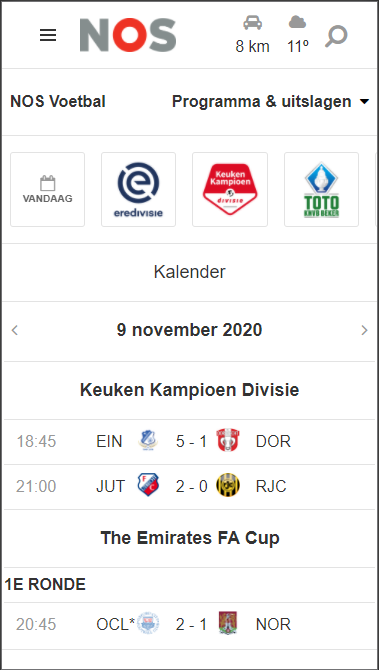 
Het eindresultaat van de wedstrijd pagina 
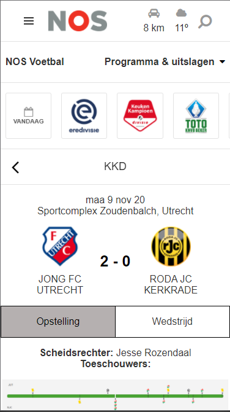

## Voortgang 3 (week 6)

-dit ging goed & dit was lastig- 
Na vragen te hebben gesteld op het frontend kanaal voor mijn doorlink probleem ben ik op zoek gegaan naar een javascript manier. Uiteindelijk heb ik het werken gekregen maar nog niet zoals ik zou willen. Hier zal ik dan ook nog naar vragen.

## Voortgang 2 (week 5)

-dit ging goed & dit was lastig- 
voor dit voortgangsmoment had ik een aantal vragen en probleempjes samengevat. dit waren:

Moet ik alles overnemen aangezien de pagina door een api veranderd wordt?
Moet ik de diagrammen overnemen in html en css?
Een tr tag kan niet in een a tag vallen, Hoe moet ik dit oplossen?

Het doorlinken was voor mij een heel erg struikelblok aangezien ik dit perfect wilde doen en het niet zo eruit kwam als ik zou willen.

## Voortgang 1 (week 3)

### Stand van zaken

-dit ging goed & dit was lastig- 
Niets ging eigenlijk heel slecht, ik heb een paar keer ruzie gehad met de css die niet eruit kwam zoals ik wilde of helemaal niet maar na goed kijken is dat mij gelukt.

**Screenshot(s):**

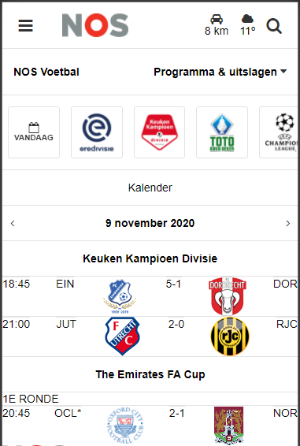
### Agenda voor meeting

-samen met je groepje opstellen-

| student 1      | student 2          | student 3    | student 4        |
| ---            | ---                | ---          | ---              |
| dit bespreken  | en dit             | en ik dit    | en dan ik dat    |
| an dat ook nog | dit als er tijd is | nog een punt | dit wil ik zeker |
| ...            | ...                | ...          | ...              |

### Verslag van meeting

-na afloop snel uitkomsten vastleggen-

## Breakdownschets (week 1)

**Breakdownschets voor de hele pagina** 
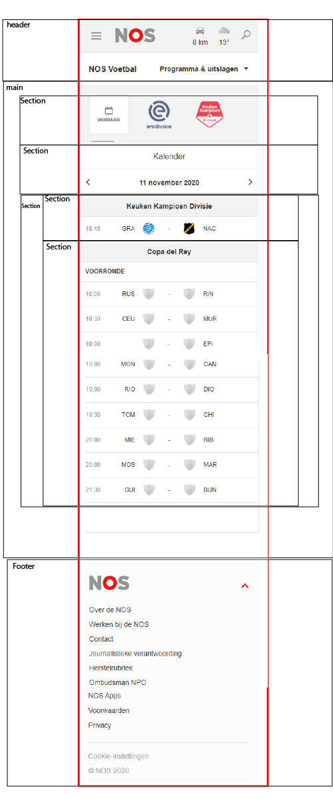

**Breakdownschets gedetailleerd op meerdere sections** 
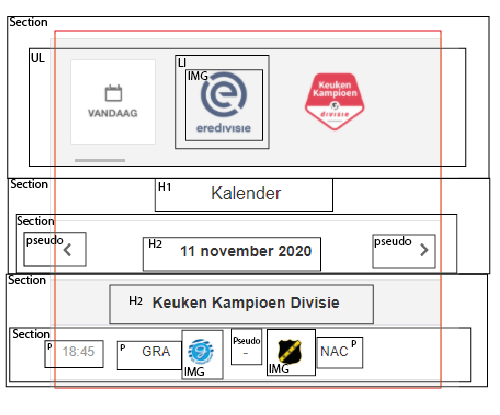

## Intake (week 1)

**Je startniveau:** Rood

**Je focus:** responsive

**Je opdracht:** https://nos.nl/sport/voetbal/uitslagen/

**Screenshot(s) van de eerste pagina (small screen) overzichtspagina:**

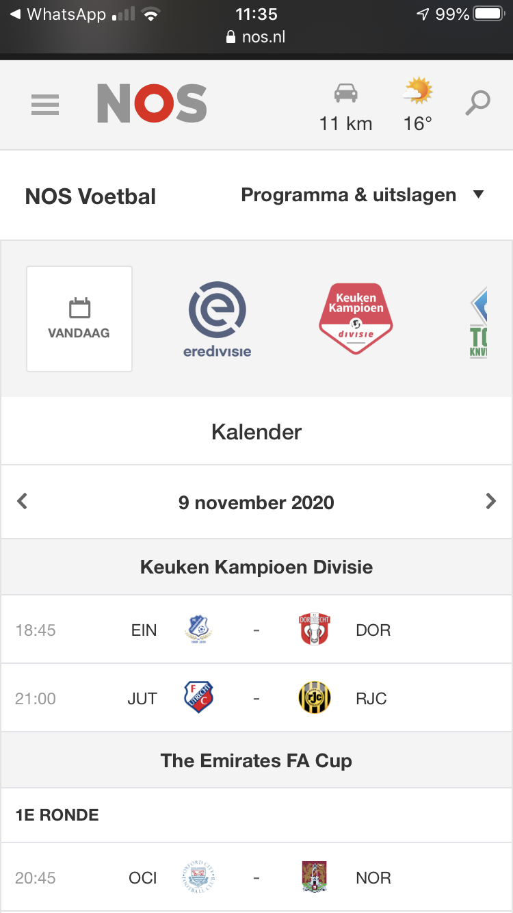
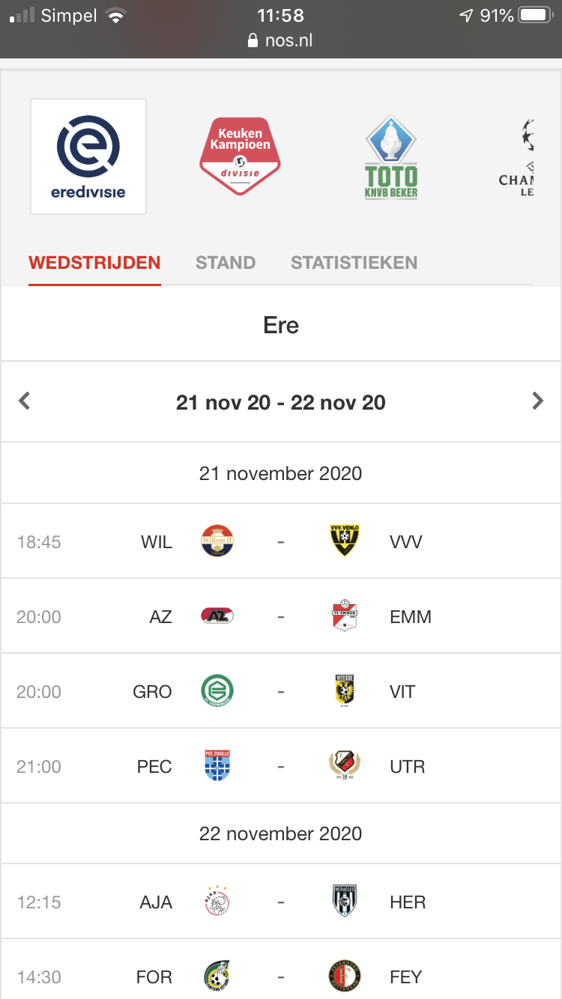

**Screenshot(s) van de tweede pagina (small screen) wedstrijdpagina:**
**Wedstrijd**
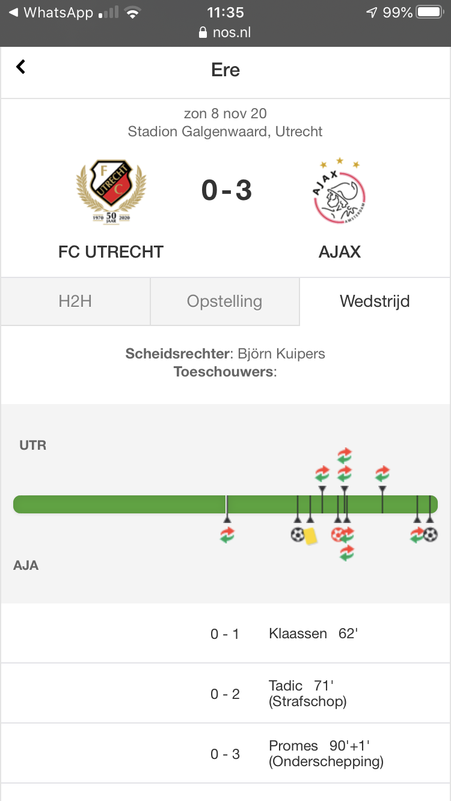 
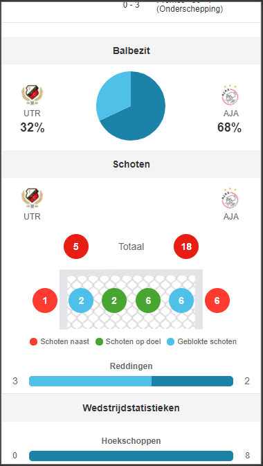 
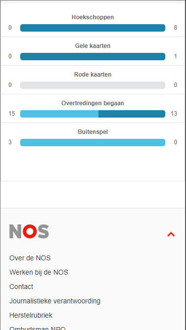 
**Opstelling** 
 
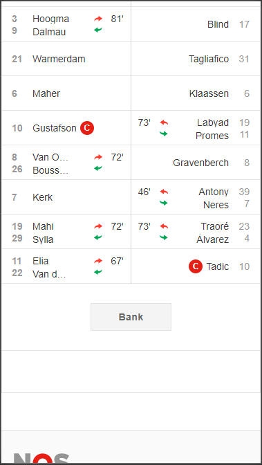 
**Onderling resultaat** 
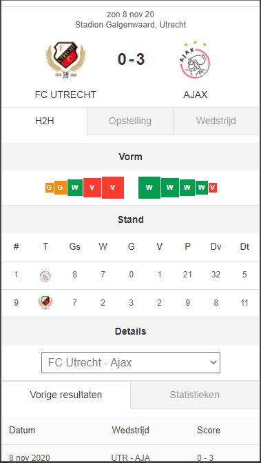 
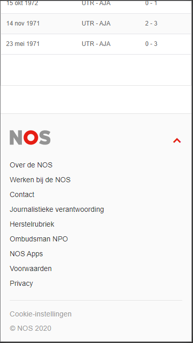 

**Voor de wedstrijd** 
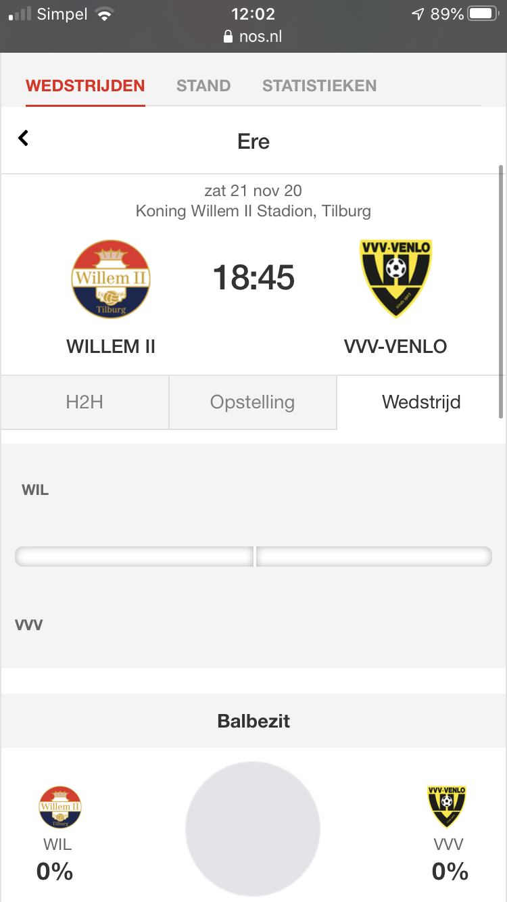
